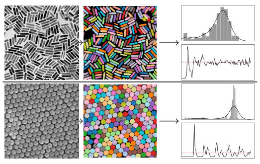

# bpartis

**B**ayesian **Part**icle **I**nstance **S**egmentation for Electron Microscopy Image Quantification

<p align="center">
    
</p>

This repository contains the official implementation of **bpartis** — a Bayesian deep neural network for nanoparticle instance segmentation. 

## Demo

Try an in-browser demo on your electron microscopy images [here](https://imagedataextractor.org/demo).

## Usage

If you would like to use a pretrained **bpartis** model, we strongly recommend using [imagedataextractor](https://github.com/by256/imagedataextractor) to do so.

```python
import cv2
from imagedataextractor.segment import ParticleSegmenter

image = cv2.imread('<path/to/image>')  # PIL can also be used
segmenter = ParticleSegmenter()

segmentation, uncertainty, _ = segmenter.segment(image)

```

More detailed information can be found in the imagedataextractor segmentation [documentation](https://imagedataextractor.org/docs/segmentation).

## Training

If you are interested in training **bpartis** to reproduce our results, follow these steps:

#### Installation

1. Clone the repository
```bash
git clone https://github.com/by256/bpartis.git
```

2. Install requirements
```bash
python3 -m pip install -r requirements.txt
```

#### Training BPartIS

3. Download the EMPS dataset from [here](https://github.com/by256/emps).

4. Train the BPartIS model on the EMPS dataset.

```bash
python bpartis/train.py --data-dir=<path/to/emps/dir/> --device=cuda --epochs=300 --save-dir=bpartis/saved_models/
```

## Citing

If you use **bpartis** in your work, please cite the following work:

B. Yildirim, J. M. Cole, "Bayesian Particle Instance Segmentation for Electron Microscopy Image Quantification", *J. Chem. Inf. Model.* (**2021**) https://doi.org/10.1021/acs.jcim.0c01455

```
@article{doi:10.1021/acs.jcim.0c01455,
	author = {Yildirim, Batuhan and Cole, Jacqueline M.},
	title = {Bayesian Particle Instance Segmentation for Electron Microscopy Image Quantification},
	journal = {Journal of Chemical Information and Modeling},
	volume = {61},
	number = {3},
	pages = {1136-1149},
	year = {2021},
	doi = {10.1021/acs.jcim.0c01455},
	note ={PMID: 33682402},
	URL = {https://doi.org/10.1021/acs.jcim.0c01455}
}
```

## Funding

This project was financially supported by the [Science and Technology Facilities Council (STFC)](https://stfc.ukri.org/) and the [Royal Academy of Engineering](https://www.raeng.org.uk/) (RCSRF1819\7\10).
